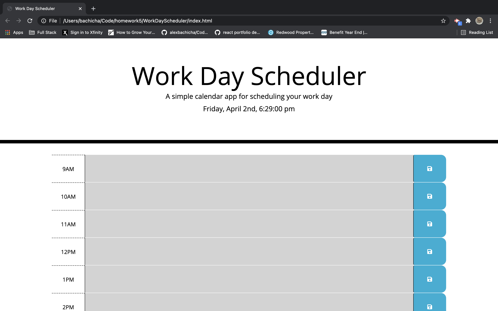

# Work Day Scheduler 

## Description

The Work Day Scheduler is a calendar application that allows a user to save events for each hour of the day. This application runs in the browser and features dynamically updated HTML and CSS powered by jQuery. The application also uses Moment.js to work with the dates and times.

## Table of Contents

* [Installation](#installation)
* [Usage](#usage)
* [Credits](#credits)
* [License](#license)

## Installation 

View Work Day Scheduler deployed on [GitHub]()

## Usage

The calendar is make to represent a typical workday. In this case, it runs from 8 am to 5 pm 

Each block is color coordinated to show the user whether the event has past, is happening, or is going to happpen (Past = Grey, Present = Red, Future = Green)

Once the user enters an event, a save button can be clicked to store this event in the calender

Events are saved to local storage. When the webpage is refreshed, the events also remain in place

## Credits

Third party assets include

* [Moment.js](https://momentjs.com/)
* [Bootstrap](https://getboostrap.com)
* [FontAwesome](https://fontawesome.com/)

## License

Licensed under the [MIT License](license.txt)